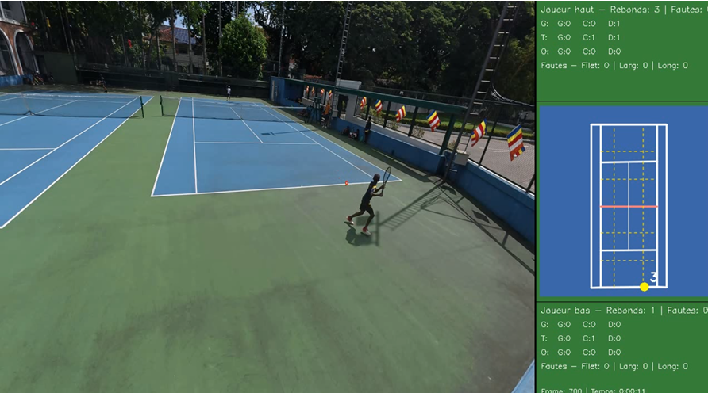
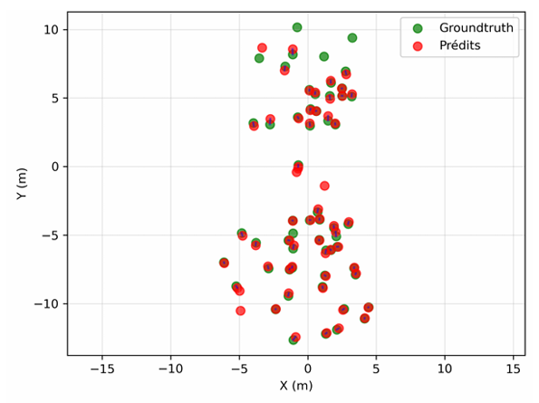
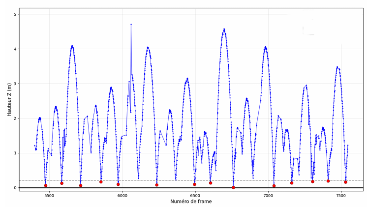
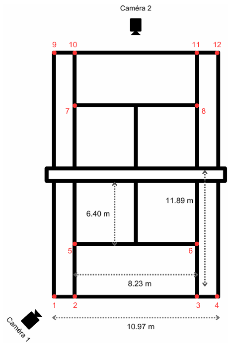

# Tennis Ball Bounce Detection & Tactical Zone Visualization

> Two-camera computer vision system for automatic tennis ball bounce detection and tactical zone visualization — bridging the gap between expensive professional systems (Hawk-Eye, PlaySight) and limited single-camera solutions (SwingVision).


## 📽️ Demo

<!-- Replace this line with your demo video once uploaded -->
*Demo video coming soon — side-by-side view of ball tracking and top-down bounce visualization.*




## 📊 Results

| Metric | Value |
|--------|-------|
| 3D reconstruction RMS error | 3.97 cm |
| Bounce detection Precision | 0.895 |
| Bounce detection Recall | 0.911 |
| Bounce detection **F1-Score** | **0.903** |
| Spatial accuracy (court width) | MAE: 3.6 cm |
| Spatial accuracy (court length) | MAE: 12.7 cm |
| Overall 2D spatial accuracy | MAE: 13.9 cm |

The F1-Score of **90.3%** outperforms comparable academic systems:
- Sarıalioğlu et al. (2024) — single stereo camera: 82.39%
- Yang et al. (2023) — multi-camera robot system: 81.4%




## 🎯 Motivation

Tactical analysis in tennis requires knowing precisely where the ball bounces on the court. Professional systems like **Hawk-Eye** (8–10 high-speed cameras) or **PlaySight SmartCourt** (6 HD cameras + fixed installation) deliver excellent precision but remain out of reach for most amateur clubs. More affordable solutions like **SwingVision** rely on a single camera, making them vulnerable to occlusions and limited in spatial accuracy.

This project explores whether two synchronized consumer cameras can provide sufficient accuracy for meaningful tactical analysis — making bounce detection and zone visualization accessible to resource-limited training structures.

---

## ⚙️ System Pipeline

```
Camera 1 (4K 60fps)  ──┐
                        ├──▶ Synchronization ──▶ Camera Calibration
Camera 2 (4K 60fps)  ──┘                              │
                                                       ▼
                                         3D Court Reconstruction
                                                       │
                                                       ▼
                                    Ball Tracking (GridTrackNet)
                                                       │
                                                       ▼
                                         Bounce Detection
                                                       │
                                                       ▼
                              Tactical Zone Visualization
                              (Side-by-side: acquisition + top-down view)
```

---

## 🛠️ Methodology

### Camera Setup
Two **DJI Osmo Action 5 Pro** cameras were configured at 4K resolution (3840×2160px) and 60 fps, positioned behind each baseline on opposite ends of the court. Temporal synchronization was achieved using a **DEITY TC-11** timecode generator.



### Camera Calibration
**Intrinsic calibration** determined each camera's internal parameters using a checkerboard pattern filmed from multiple angles, implemented via OpenCV.

**Extrinsic calibration** established each camera's position and orientation in the real world using known reference points on the court, enabling precise 3D reconstruction.

### 3D Court Reconstruction
The calibrated camera parameters were used to establish a shared 3D reference frame for the court. Multiple triangulation approaches were evaluated, and the best-performing method was selected and further refined through iterative optimization.

### Ball Tracking
2D ball coordinates were extracted from both videos using **[GridTrackNet](https://github.com/VKorpelshoek/GridTrackNet)** (Korpelshoek, 2023), a real-time CNN-based tennis ball tracker. Detections were then projected into the shared 3D court reference frame. A spatial filtering step removed false detections from outside the court area.

### Bounce Detection
A custom bounce detection algorithm was developed to automatically identify the moment and location of each ball bounce from the reconstructed 3D trajectory. Detected bounces are automatically assigned to the corresponding player based on their position relative to the court center.

### Tactical Zone Visualization
The system generates a **side-by-side video** combining the acquisition footage with a synchronized top-down court view. The court is segmented into 9 tactical zones per half, inspired by the framework of Giampaolo & Levey (2013):

- **3 longitudinal zones:** Grind (G), Torment (T), Obliterate (O)
- **3 lateral zones:** Left, Center, Right

Bounces are displayed as **yellow dots** (in-bounds) or **red dots** (faults), synchronized with the video. A per-zone bounce counter is overlaid for both players.

---

## 🔧 Tech Stack

| Category | Tools |
|----------|-------|
| Programming | Python |
| Computer Vision | OpenCV |
| Ball Tracking | GridTrackNet (Korpelshoek, 2023) |
| Hardware | DJI Osmo Action 5 Pro × 2, DEITY TC-11 timecode generator |

---

## ⚠️ Limitations

- Evaluated on a single match between two amateur players — generalization to higher ball speeds and competitive play is not yet confirmed
- Frame rate constraints may occasionally miss very fast bounces
- Higher spatial error along the court length axis due to camera positioning geometry
- Cameras may overheat after extended use in tropical conditions

---

## 🔭 Future Work

- Net fault detection
- Stroke detection and ball speed estimation
- Player tracking and movement analysis
- Automated per-player statistical reports by zone and shot type
- Validation across different player levels, surfaces, and lighting conditions

---

## 📚 Academic Reference

This system was developed as part of a Master's thesis:

> **Birba, J. (2025).** *Tennis Ball Bounce Detection and Tactical Zone Visualization in Amateur Context.* Master 2 — Digital Sciences and Sport (EUR Digisport), Université Rennes 2 / Synergy Tennis, Colombo, Sri Lanka. Grade: 17/20.
>
> Supervised by Romain Tavenard (Université Rennes 2) and Renouk Wijemanne (Synergy Tennis).

---

## 🙏 Acknowledgements

- **[GridTrackNet](https://github.com/VKorpelshoek/GridTrackNet)** — Real-time tennis ball tracking CNN by V. Korpelshoek (Delft University of Technology, 2023). Used for 2D ball coordinate extraction.
- **Synergy Tennis**, Colombo, Sri Lanka — for hosting the internship and providing the court and players for data collection.
- **Renouk Wijemanne** — former Sri Lanka champion and Davis Cup coach, professional supervisor.

---

## 📄 License

This project is licensed under the MIT License — see the [LICENSE](LICENSE) file for details.

> ⚠️ **Note:** The source code is not publicly available. This repository is a project showcase presenting methodology, results, and visualizations. The core algorithm is proprietary. For academic collaboration or inquiries, feel free to reach out.

---

*Built with 🎾 in Sri Lanka — Jérémy Birba | [LinkedIn](https://linkedin.com/in/birba-jeremy)*
